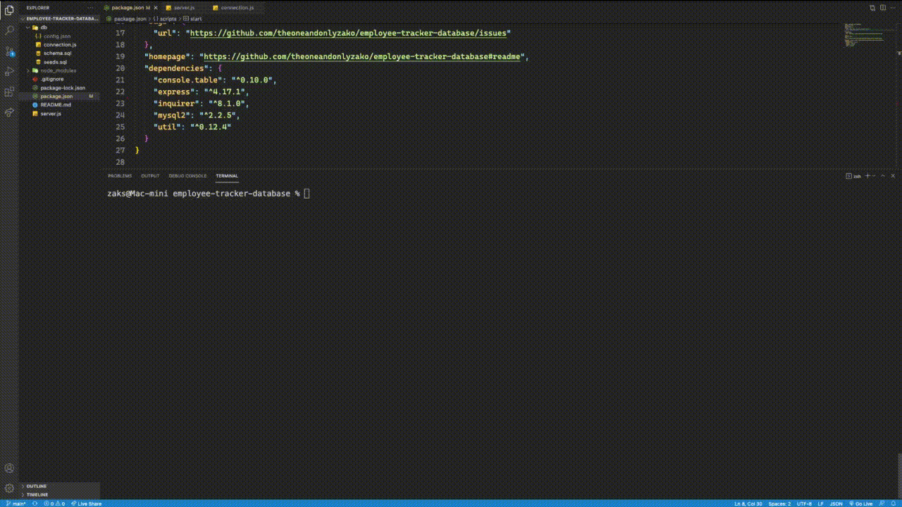

# employee-tracker-database

  Repo Link: https://github.com/theoneandonlyzako/employee-tracker-database
   
  Demo Video Link: https://youtu.be/Q7RM1xch378
    
  

  # Description
  As A business owner
I want to be able to view and manage the departments, roles, and employees in my company
so that I can organize and plan my business.
  
  # Table of Contents 
  * [Installation](#installation)
  * [Usage](#usage)
  * [License](#license)
  * [Contributing](#contributing)
  * [Steps](#steps)
  * [Contact](#contact)
  
  # Installation
  The following must be installed or linked in order to run the application properly: np express, inquirer, mysql2, util
  
  # Usage
  ​Keeping track of an employee database 
 
  # License
  This project is licensed under the Unlicense license.
  
  # Contributing
  ​Contributors: Zak Stamps With Lots of help from our trusty 'ol friend Google.
  
  # Steps
  GIVEN a command-line application that accepts user input
WHEN I start the application 
THEN I am presented with the following options: view all departments, view all roles, view all employees, add a department, add a role, add an employee, and update an employee role 
WHEN I choose to view all departments 
THEN I am presented with a formatted table showing department names and department ids 
WHEN I choose to view all roles 
THEN I am presented with the job title, role id, the department that role belongs to, and the salary for that role 
WHEN I choose to view all employees 
THEN I am presented with a formatted table showing employee data, including employee ids, first names, last names, job titles, departments, salaries, and managers that the employees report to 
WHEN I choose to add a department 
THEN I am prompted to enter the name of the department and that department is added to the database 
WHEN I choose to add a role 
THEN I am prompted to enter the name, salary, and department for the role and that role is added to the database 
WHEN I choose to add an employee 
THEN I am prompted to enter the employee’s first name, last name, role, and manager and that employee is added to the database 
WHEN I choose to update an employee role 
THEN I am prompted to select an employee to update and their new role and this information is updated in the database 
  
  # Contact
  If you have any questions about the repo, open an issue or contact me directly at theoneandonlyzako@gmail.com.
      
  Demo Video Link: https://youtu.be/Q7RM1xch378
    
  
    
  
